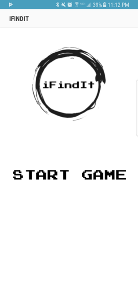
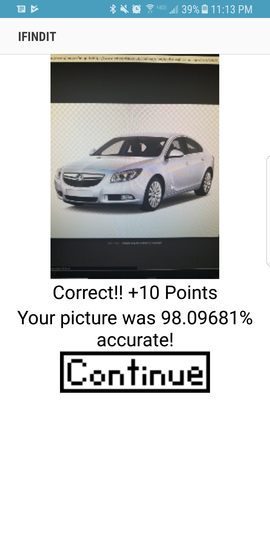
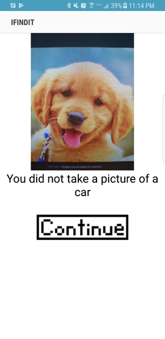
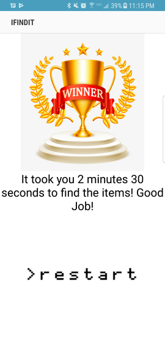

# iFindIt
iFindIt is a game based on the Google Vision API which asks the user to find a certain object and if the object is in the picture the user took (based on the API result) then the user gets 10 points, if the object is not in the picture then the user has to retry. The user wins by getting 30 points total. The app will let you know how long it took the user to get the full 30 points so the user can improve the time in the next play through. The purpose of the making the game was to create a fun and entertaining game that anyone can pick up and play.

## System Design 
Requirements:
1) Android Phone with camera
2) Internet access
3) Minimum Android 5.0
4) Target Android 7.0
5) 31.39 MB Storage space

When you first open the app you will be brought to this page:

After the user pushes the "Start Game" button they will be brought to the find it page, this is where the user gets told what to find:

The user will then push the start button (which will start a timer in the background) and be taken to the camera to take a picture. At this point there are two options for the app to go.
One the user took a picture of the object:
If the user was right the app will give the user 10 points and tell them how accurate the picture take was to the object given.

Two the user did not take a picture of the object:
If the user was wrong the app will give a nice message saying that they did not accurately take a picture of the object.

At this point the user can push "Continue" to try again, or if the user was right and they have 30 points the app will take them to the Winner screen(below). At which point they can see how long it took them to find the objects and restart if they so chose.

